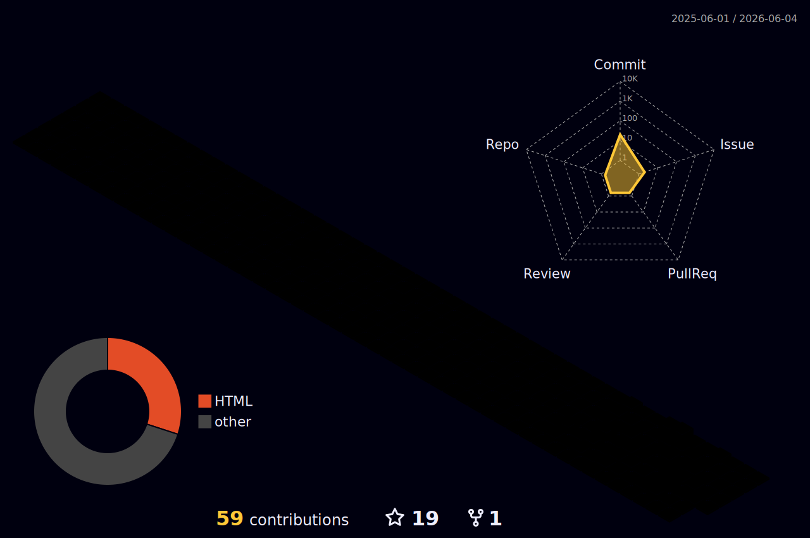

<!-- 动态打字效果 -->
<!-- dynamic typing effect 动态打字效果 -->
<div align="center">
  
</div>

<!-- 敲代码的图片 -->
<div align="center" ></div>

<br>

<!-- 个人资料徽标 -->
<div align="center">
  <a href="https://github.com/eglhub"></a>&emsp;
  <!-- wakatime 代码时间统计 -->
  <a href="https://wakatime.com/@3766a85e-b5a4-4b7d-8938-01619e4579c8"></a>
</div>

<!-- 贪吃蛇代码贡献图 -->
<div align="center">
  
</div>

#  🙋 Hello
<p>✍️&nbsp;&nbsp;Hello everyone, I'm eglhub (EGL) 🧑‍💻 I love computer science and Internet, and I want to become a senior programmer! We're making the world a better place through constructing elegant hierarchies for maximum code reuse and extensibility.</p>

💪 正在学习: 
&emsp;&emsp;


🧠 计划学习:
&emsp;&emsp;


🧰 常用的工具:
&emsp;&emsp; 


<!-- Gif -->
<div align="center">
  
  
  
  
  
  
  
  
</div>

<!-- just img -->
<div align="center"></div>

<!-- profile-3d-contrib -->
<div align="center" ></div>


# 🚀 Actions

<!-- 连续提交代码天数记录 -->
<div align="center">
  
  
  
</div>

<br>

<!-- metrics 基础资料 -->
<div align="center"></div>

<br>

<!-- Dynamic Quotes -->
<div align="center"></div>

<!-- GitHub奖杯🏆 -->
<div align="center"></div>

<!-- wakatime 统计 -->
<table align="center">
<tr>
<td valign="top">  

<!--START_SECTION:waka-->
**I'm an Early 🐤** 

```text
🌞 Morning                20 commits          ██████░░░░░░░░░░░░░░░░░░░   22.22 % 
🌆 Daytime                31 commits          █████████░░░░░░░░░░░░░░░░   34.44 % 
🌃 Evening                34 commits          █████████░░░░░░░░░░░░░░░░   37.78 % 
🌙 Night                  5 commits           █░░░░░░░░░░░░░░░░░░░░░░░░   05.56 % 
```
📅 **I'm Most Productive on Tuesday** 

```text
Monday                   11 commits          ███░░░░░░░░░░░░░░░░░░░░░░   12.22 % 
Tuesday                  23 commits          ██████░░░░░░░░░░░░░░░░░░░   25.56 % 
Wednesday                17 commits          █████░░░░░░░░░░░░░░░░░░░░   18.89 % 
Thursday                 7 commits           ██░░░░░░░░░░░░░░░░░░░░░░░   07.78 % 
Friday                   16 commits          ████░░░░░░░░░░░░░░░░░░░░░   17.78 % 
Saturday                 9 commits           ██░░░░░░░░░░░░░░░░░░░░░░░   10.00 % 
Sunday                   7 commits           ██░░░░░░░░░░░░░░░░░░░░░░░   07.78 % 
```


📊 **This Week I Spent My Time On** 

```text
🕑︎ Time Zone: Asia/Shanghai

💬 Programming Languages: 
No Activity Tracked This Week

🔥 Editors: 
No Activity Tracked This Week

💻 Operating System: 
No Activity Tracked This Week
```


 Last Updated on 16/05/2026 00:50:38 UTC
<!--END_SECTION:waka-->

</td>
</tr>

</table>
<!-- GitHub Activity Graph -->
<table align="center">
  <tr>
    <td colspan="2">
      
    </td>
  </tr>
</table>

# 🎯 𝙼𝚎𝚝𝚛𝚒𝚌𝚜

<!-- just img -->
<div align="center"></div>

<!-- plugin metrics -->
<div align="center">
  
  
</div>

